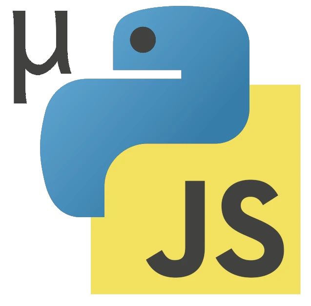

# muPyJS  

Minimal Python subset that translate to modern JavaScript

Motivation/design choices

Initial Roadmap/tasks
- [x] initial parser
- [x] AST-prettyprinter
- [x] run example from README.md
- [ ] initial compiler
- [ ] JS prettier service
- [ ] test examples from README.md

Vision:

- transpilation py to js
	- µPython to AST
	- AST to JS
- code transformations
	- AST to µPY
	- partial evaluation
- two-way, also to/from JS+types (µTS)


# AST
### Names

```python
some_name
```

```AST
(name "some_name")
```

```js
some_name
```
### Literal `(num "123")` or `"str"`

### function-call
```python
foo(blah, *args)
bar(**kwargs)
baz("foo", bar=123)
```

```AST
(call foo blah (splat args))
(call bar (dict "_kwargs" True (splat kwargs)))
(call baz "foo" (dict "_kwargs" True "bar" 123))
```

```js
foo(blah, ...args)
bar({...kwargs})
baz(foo, {_kwargs: true, bar: 123})
```
### methodcall `(.`_methodName_` obj ..args)`
- `call obj method args()` sugar: `obj.method(arg-seq)`
	- sugar: `o.methodname(...annotations, ...args)` 
	- sugar: `o.(...)` = `o(...)` or `new O(...)` if o is uppercase. Not overloadable
	- sugar: `o.__get__("foo")` = `o["foo"]`
	- sugar: `o.__getattr__("foo")` = `o.foo`
	- sugar: `o.__set__("foo", bar)` = `o["foo"] = bar`
	- sugar: `o.__setattr__("foo", bar)` = `o.foo = bar`
	- sugar: `a.__add__(b)`... = `a+b`...
	- sugar: `[...]` = `List(...)`, `{...}` = `Dict(key, val, ...)` 
	- sugar: `"...".__format__(a, b)` = `f"foo {a}  {b}"`
#### non-method call and object instantiation `(. fn ..args)`
- Python: `fn(..args)`
- JavaScript: `fn(..args)` or `new Fn(..args)` if fn i starting with an uppercase letter
### And/or `(and a b)` / `(or a b)`

### Outer/global `(set name val)`

### Splats `(splat obj)`

### Classes

### Dicts

### Function definitions `fn`, `arg`

### If-else

### blocks `do`

### subscripts
### Slices


# Spec and test

This document is both the language spec, and also unit test for the compiler. All language features are documented here, with example of python code, the expected AST, and expected JS.

The testrunner reads the spec, extract python/AST/JS run the compiler on the code.

```python
print("hello world")
```

```AST
(call print "hello world")
```

```js
print("hello world")
```
# AST Object

Each AST-node has
- type
- meta-data
- children (either AST-nodes or strings)

AST-nodes can be serialised(without meta) as `[type ..children]`

# AST types
## Expressions
### Name `(name "str")`
### Literal `(num "123")` or `"str"`

### Call `(.`_methodName_` obj ..args)`
- `call obj method args()` sugar: `obj.method(arg-seq)`
	- sugar: `o.methodname(...annotations, ...args)` 
	- sugar: `o.(...)` = `o(...)` or `new O(...)` if o is uppercase. Not overloadable
	- sugar: `o.__get__("foo")` = `o["foo"]`
	- sugar: `o.__getattr__("foo")` = `o.foo`
	- sugar: `o.__set__("foo", bar)` = `o["foo"] = bar`
	- sugar: `o.__setattr__("foo", bar)` = `o.foo = bar`
	- sugar: `a.__add__(b)`... = `a+b`...
	- sugar: `[...]` = `List(...)`, `{...}` = `Dict(key, val, ...)` 
	- sugar: `"...".__format__(a, b)` = `f"foo {a}  {b}"`
#### non-method call and object instantiation `(. fn ..args)`
- Python: `fn(..args)`
- JavaScript: `fn(..args)` or `new Fn(..args)` if fn i starting with an uppercase letter
### And/or `(and a b)` / `(or a b)`
### Ternary `(ifelse p a b)`
- python `a if p else b`
- javascript `p ? a : b`
# Statements
## Bind
### Local `(let name val)`
### Iterator (only in for) `(iter name seq)`
### Arguments (only in fn) `(arg name default)`
### Import `(import name module)`
- Python: `import module [as name]`
- JS: `import * as name from module`
### Partial import `(import-from name module)`
- Python: `import var from module`
- JS: `import {vars} from module`
### Define function/method `(def name (arg a) (arg b) ..body)`
### Define class `(class name (extends class)? ..method-defs)`
## Annotate 
(immediatly after name in binding)
### Documentation `(doc "some doc")`
### Type annotation/cast `(type "typename")`
### Async `(async)`
### Decorators `(decorate (. fn ..args) (.fn ..args))`


## Control
### For `(for (iter name seq) ...body)`
### Try `(try body ..handlers)`
### Except (only try-handler) `(except (let name) ..body)`
Only catches `Exception`
### Finally (only as try-handler) `(finally ..body)`
### While `(while cond ..body)`
### If/else `(if pred body ...pred/body else-body)`
### Yield `(yield val)`
### Return/break/continue `(return val)`, `(break)`, `(continue)`
### Raise `(. raise exception)`
- Python: `raise exception`
- JavaScript `throw exception` (exception  must be instanceof Exception)
## Misc
### Block `(do ..body)`
### Splat `(.. obj)`
# Old notes
Lisp-tree-structure from python subset

- AST-nodes `[type, {metadata}, ...children]`
	- **splat** `(.. obj)`
	- **block** `(do ...)`
	- **bind** 
		- `(let name val)` define/redefine local
		- `(set name val)`  overwrite outer
		- `(var name...)` assigned iter
	- **control** `{type, children}`
		- `(for (var a) seq ...body)`
			- sugar `for a b c` = `for a in b do? c`
		- `(try body ..handlers)`
		- `(except (let name) ..body` (only as try-handler)
		- `(finally ..body)`
		- `(while cond ..body)`
		- `(if cond1 body1 [cond2 body2...] [else])
			- sugar `ifelse a a b` = `a or b`
			- sugar `ifelse a b a` = `a and b`
			- sugar `ifelse a b` = `if a b`
			- sugar `ifelse a b c` = `if a b else c`
			- sugar `ifelse a b (ifelse c d e)`  `if a b elif c d else e`
		- `(return val)`, `(yield val)`, `(raise val)`, `(break)`, `(continue)`
	- **class** (...)
	- **function** `(fn async? :type #"doc"  name (var a b c) ...body)`

- AST annotations
	- `async` `static` attatches to following node
	- `\n\n/*...*/` attaches docstring to following node
	- `: type` attaches to preceding node

type-annotations: cast(type, expr)

# notes


[[Minimal Python notes]]
[[Mupyjs]] is a subset of Python and MicroPython optimised to translate and run efficiently on JavaScript. It has certain semantic restrictions and syntactic requirements:

- Object instantiation is done with `new(Class(...))` instead of just `Class(...)`
- Function parameters are either args or kwargs, not both. If you want a parameter to be positional, make sure a `/` is added to the parameter list.
- Separation of functions/method, if `self` as first paramter, they can only be called as methods on an object.
- Use type-hints if arithmetic should run fast.
- It is not possible to test if an object is a `float` or `int` at runtime. Use `is_num(n)` to test if it is a number. 
### Compilation to JS
[[Mupyjs]] translates directly into js.
- Every value must be an object, special Null object is used instead of undefined/nil.
- operators are such as `+` compiles to `__add__` etc. unless type hints indicate they are integer or string.
- truth value is `.__bool__()` unless typehints indicate that it is already a boolean
---

----


- `a[b:c]` -> `a.__getitem__(slice(b,c))`

Library
- slice
- isinstance