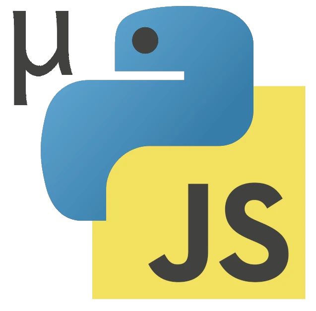

# mupyjs    
µPyJS is a Minimal Python subset that translate to modern JavaScript
- Mypyjs code must be valid Python code.
- Only a small subset of Python, that can run efficiently on JS-engines, are implemented. Full Python compatibility is a non-goal.
- AST should be as simple as possible, and relatively flat, – to be easy to work with, both programmatically and as an s-expression
# Milestones
- [x] 0.0.1 Compile + compare examples from spec
- [x] 0.0.2 Compile snapshot of itself 
- [ ] 0.0.3 Start create runtime, and have some running code + update language doc
- [ ] 0.0.4 Add runtime to compile itself (from pre-parsed AST)
### Someday maybe features
- Type inference + type-directed performance optimizations
- Transform AST back to python (for easy metaprogramming, partial-evaluation, etc)
# Language Documentation
The language is designed around having a simple abstract syntax tree, with mapping from python and to js.

Each node in the syntax tree has a type and a list of children, which are either AST-nodes or strings. 

The following text will go through the different type of AST-nodes, and their corresponding Python and JavaScript. This document is also an executable test, that checks that the Python code actually compiles to the AST and JavaScript.

The AST can be prettyprinted similar to an S-expression, such that 

```
{type: "some_type", 
 children: [
   {type: "another_node", children: []}, 
   {type: "num", children: ["123"]}, 
   {type: "name", children:["a_name"]} 
   "a string"]
```

 can be written as `(some_type (another_node) 123 a_name "a string")`.

There are two kinds of types in the ast.
- *method calls*: types starting with `.` are method calls, so `(.__add__ a b)` is calling the `__add__` method on `a`
- *builtin types*: everything else

## Values
String and number literals in Python, AST and JavaScript:

```python
"foo"
123
```

```AST
"foo"
123
```

```js
"foo"
123
```

Formatted strings has the special `.__fstr` method in the AST

```python
f""
f"foo{bar}{baz}"
f'{123}blah'
f"""{hello}"""
```

```AST
(.__fstr "")
(.__fstr "foo" bar baz)
(.__fstr "" 123 "blah")
(.__fstr "" hello)
```

```js
""
"foo" + bar + baz;
"" + 123 + "blah";
"" + hello;
```

## Lists and dicts

List and dicts are also available. Lists maps to JS-arrays. Dicts are not mapped to JS-Objects due to Objects overlap between attributes and items.

```python
[1, 2, *o]
{"foo": 1, "bar": 2, **o}
(1, 2, 3)
```

```AST
(.__list 1 2 (splat o))
(.__dict "foo" 1 "bar" 2 (splat o))
(.__tuple 1 2 3)
```

```js
[1,2,...o];
__dict("foo", 1, "bar", 2, ...o);
[1,2,3];
```

TODO: sets etc.
## Names

Names are pass through with AST-nodes .

```python
some_name
```

```AST
(name "some_name")
```

```js
some_name
```


Some built-in names needs to be mapped from Python to JavaScript naming. 
- `pass` is just the empty string.
- `Nil` is an mupyjs-runtime object, for methods that would error if called on undefined, – for instance `(might_be_null ?? Nil).__eq__(a)`

```python
foo
None
True
False
pass
Nil
```

```AST
foo
None
True
False
pass
Nil
```

```js
foo
undefined
true
false

Nil
```
## Assignment

variables should be assigned as local vars with var the first time it is seen within a scope, to has similar semantics as python

```python
foo = 123
foo = bar(baz)

def bar():
	foo = 432
	foo = "hello"
```

```AST
(set foo 123)
(set foo (.__call__ bar baz))
(fn bar (set foo 432) (set foo "hello"))
```

```js
var foo = 123;
foo = bar(baz);
function bar() {
	var foo = 432;
	foo = "hello";
}
```
### global and nonlocal

`global` and `nonlocal` can be used to affect the scoping.


```python
def foo():
	global x, z
	x = 3
	y = 4
```

```AST
(fn foo (global x z)
    (set x 3)
	(set y 4))
```

```js
function foo() {
	x = 3;
	var y = 4;
}
```

`var` is used instead of `let`/`const`, to match pythons scoping rule, where a value can be assigned to function-scope from within an if-block etc.
### Augmented assignment

Augemented assignment are expanded:

```python
a += 1
foo.bar += 1
foo["bar"] += 1
```

```AST
(set a (.__add__ a 1))
(.__setattr__ foo "bar" (.__add__ (.__getattr__ foo "bar") 1))
(.__setitem__ foo "bar" (.__add__ (.__getitem__ foo "bar") 1))
```

```js
var a = a.__add__(1);
foo['bar'] = foo.bar.__add__(1);
foo.__setitem__('bar', foo.__getitem__('bar').__add__(1));
```

## Functions
Arguments are either positional or keyword, and cannot be both:

```python
def foo(a, b, *, d, e):
	return 3
```

```AST
(fn foo (arg a) (arg b) (kwarg d) (kwarg e) (return 3))
```

```js
function foo(a, b, {d, e}) {
	return 3;
}
```

Kwargs are passed as last argument if present in the function call. Includes special property `{_kwargs: true}` similar to transcrypt.

```python
foo(123, c="hello")
```

```AST
(.__call__ foo 123 (kwargs "c" "hello"))
```

```js
foo(123, {_kwargs: true, c: "hello"})
```

Splats are also supported

```python
foo(blah, *args)
bar(**kwargs)
baz("foo", bar=123)
```

```AST
(.__call__ foo blah (splat args))
(.__call__ bar (kwargs (splat kwargs)))
(.__call__ baz "foo" (kwargs "bar" 123))
```

```js
foo(blah, ...args)
bar({"_kwargs": true, ...kwargs})
baz("foo", {"_kwargs": true, bar: 123})
```


"Functions" that starts with an uppecase letter are constructors, and invoked with `new` under JavaScript

```python
SomeClass(123)
```

```AST
(.__call__ SomeClass 123)
```

```js
new SomeClass(123)
```

"Functions" are either methods (with `self` as first parameter) or functions, and cannot be called in both ways.

```python
def foo(self):
	pass
def foo(blah):
	pass
```

```AST
(fn foo (arg self))
(fn foo (arg blah))
```

```js
function foo() { const self = this; }
function foo(blah) { }
```

### Generator functions
TODO: implement generator functions and `yield`
### Async
TODO: implement async/await
## Method calls

Method calls compiles as such:

```python
foo.bar(baz)
a.b.c()
```

```AST
(.bar foo baz)
(.c (.__getattr__ a "b"))
```

```js
foo.bar(baz)
a.b.c()
```

Everything that behaves like a method-call is mappes to method-call in the AST, this includes attribute/item-access, such as  `.__getattr__`, function calls `.__call__`, operators  `+` becomes `.__add__` and so on.

This also matches the generated JS, – as we cannot use JS operators directly when we want operator overloading. (Instead of method-calls, it could also be implemented with functions, – but this is slower due to the polymorphic inline cache in modern javascript engines)

The unary operators are:

```python
-4
~123
+42
not False
```

```AST
(.__neg__ 4)
(.__invert__ 123)
(.__pos__ 42)
(.__not__ False)
```

```js
(4).__neg__();
(123).__invert__();
(42).__pos__();
false.__not__();
```

The binary operators are:

```python
a * b 
a ** b 
a // b 
a / b 
a % b 
a + b 
a - b 
a << b
a >> b
a | b
a ^ b
a & b
a @ b
```

```AST
(.__mul__ a b)
(.__pow__ a b)
(.__floordiv__ a b)
(.__truediv__ a b)
(.__mod__ a b)
(.__add__ a b)
(.__sub__ a b)
(.__lshift__ a b)
(.__rshift__ a b)
(.__or__ a b)
(.__xor__ a b)
(.__and__ a b)
(.__matmul__ a b)
```

```js
a.__mul__(b);
a.__pow__(b);
a.__floordiv__(b);
a.__truediv__(b);
a.__mod__(b);
a.__add__(b);
a.__sub__(b);
a.__lshift__(b);
a.__rshift__(b);
a.__or__(b);
a.__xor__(b);
a.__and__(b);
a.__matmul__(b);
```

The comparison operators are:

```python
a < b
a > b
a == b
a >= b
a <= b
a != b
a is b
a is not b
a in b
a not in b
```

```AST
(.__lt__ a b)
(.__gt__ a b)
(.__eq__ a b)
(.__ge__ a b)
(.__le__ a b)
(.__ne__ a b)
(.__is a b)
(.__isnot a b)
(.__contains__ b a)
(.__not__ (.__contains__ b a))
```

```js
a.__lt__(b);
a.__gt__(b);
(a ?? Nil).__eq__(b);
a.__ge__(b);
a.__le__(b);
(a ?? Nil).__ne__(b);
a === b;
a !== b;
b.__contains__(a);
b.__contains__(a).__not__();
```

Note that `?? Nil` needs to be added to those operators that may be called on None/undefined

TODO: `?? Nil` on unary `not`


## Blocks and modules

The `(do expr1 expr2 ...)` AST-node represent a sequence of statements/expressions. Modules/files are encapsulated in a `do`-block.

Module import are supported as:

```python
import foo
import foo.bar.baz
import foo as bar
from foo.bar import x, y, z
```

```AST
(import_as "foo" foo)
(import_as "foo/bar/baz" baz)
(import_as "foo" bar)
(import_from "foo/bar" x y z)
```

```js
import * as foo from "@/foo"
import * as baz from "@/foo/bar/baz"
import * as bar from "@/foo"
import {x, y, z} from "@/foo/bar"
```

TODO: exports

## Control flow

Various control-flow is implemented, such as:

If-else statements:

```python
if a: 1
if a:
  b 
  c

if e:
  f
elif g:
  h
  i
else:
  j
```

```AST
(if a 1)
(if a (do b c))
(if e f g (do h i) j)
```

```js
if(a) { 1 }
if(a) { b ; c }
if(e) { f } else if(g) { h; i} else {j}
```

While-loops:

```python
while(True):
	123
	456
```

```AST
(while True 123 456)
```

```js
while(true) { 123; 456 }
```

For-loops:

```python
for x in range(10):
	print(x)

for x in range(10):
	print(x)
```

```AST
(for (iter x (.__call__ range 10))
    (.__call__ print x))

(for (iter x (.__call__ range 10))
    (.__call__ print x))
```

```js
for(var x of range(10)) {
	print(x);
}
for(x of range(10)) {
	print(x);
}
```


## Conditional expressions

Controls-flow in expressions are also implemented:

```python
a and b
a or b
a if t else b
```

```AST
(and a b)
(or a b)
(ifelse t a b)
```

```js
a && b
a || b
t ? a : b
```

## Exceptions

Execptions are also implemented, – but the name of the caught exception must be the same acroess all execpt in a try-block:

```python
try:
	pass
except E:
	1
	2
try:
	3
	4
except E:
	5	
except E2 as e:
	6	
finally:
	7	

```

```AST
(try pass
	(except E __exception 1 2))
(try (do 3 4)
    (except E e 5)
    (except E2 e 6)
	(finally 7))

```

```js
try { } 
catch (__exception) {
  if (__exception instanceof E) { 1; 2; }
}
try { 3; 4 } 
catch (e) {
  if (e instanceof E) { 5 } 
  else if (e instanceof E2) { 6 }
} finally { 7 }
```

## Classes

Classes are defined as:
```python
def foo():
   pass
class Bar:
	def baz():
		pass
def quux():
	pass
```

```AST
(fn foo)
(class Bar
   (fn baz))
(fn quux)
```

```js
function foo() {}
class Bar {
  baz() {}
}
function quux() {}
```

TODO: inheritance

## List comprehensions / generator functions

```python
(x for x in range(2))
(x for x in range(12) if x.even())
[x+y for x in range(5) for y in range(5)]
```

```AST
(generator x 
    (iter x (.__call__ range 2)))
(generator x 
    (iter x (.__call__ range 12))
    (.even x))
(.__call__ list
    (generator (.__add__ x y)
        (iter x (.__call__ range 5))
        (iter y (.__call__ range 5))))
```


```js
(function* () {
  for (const x of range(2)) yield x;
})();
(function*() {
  for(const x of range(12))
    if(x.even())
      yield x
})()
list((function*() {
  for(const x of range(5))
    for(const y of range(5))
      yield x.__add__(y)
})())
```


# Similar initiatives and differences

- https://www.transcrypt.org almost but not quite what I want. Main difference is that transcrypt is more mature, but less optimised. Some APIs and approaches here are inspired by transcrypt


# Spec and test

This document is both the language spec, and also unit test for the compiler. All language features are documented here, with example of python code, the expected AST, and expected JS.

The testrunner reads the spec, extract python/AST/JS run the compiler on the code.

```python
print("hello world")
```

```AST
(.__call__ print "hello world")
```

```js
print("hello world")
```
# TODO/missing

(immediatly after name in binding)
### Documentation `(doc "some doc")`
Generated from doc-strings, and comments
### Type annotation/cast `(type "typename")`
Generated from type hints
### Async `(async)`
### Decorators `(decorate (. fn ..args) (.fn ..args))`
### Yield `(yield val)`
### break/continue  `(break)`, `(continue)`
### Raise `(. raise exception)`
- Python: `raise exception`
- JavaScript `throw exception` (exception  must be instanceof Exception)
# notes
[[Minimal Python notes]]
  